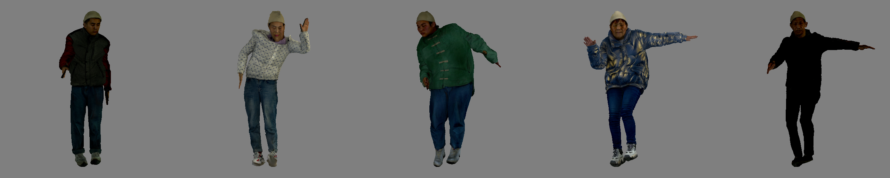
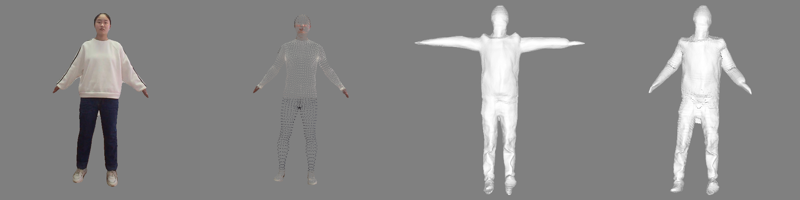

## ARCH: Animatable Reconstruction of Clothed Humans

[](https://arxiv.org/abs/2004.04572)


This repository contains the implementation (non-official) of: **ARCH:Animatable Reconstruction of Clothed Humans**  


## Installation 
**1. Setup virtual environment**

Go to the ARCH directory in the command line, then
```sh
$ sh ./install.sh 
```

**2. Download the smpl model:** 

Download smpl models from https://smpl.is.tue.mpg.de/, put them into models folder under ./smpl/models/smpl
By default we use 10 PCA models and .pkl format.

**3. Download pre-train model and extra data from this [link]().**

Put the pretrained model in ./results/ckpt, the extra data in ./data

## Data Generation 

MVPHuman provides animateble meshes in canonical pose with corresponding skinning weight. Thus, the canonical meshes can be deformed to arbitary poses for data augmentation.  Here are some examples animated from t-pose mesh. 



**0. Download motion sequence from [AIST++](https://google.github.io/aistplusplus_dataset/)**

Put them into ./data/motion/

**1. Generate Data**

Change the default path in lib/common/config.py. **obj_dir** is the obj folder and **syn_dir** is where synthetic data are saved. 
```sh
$ mv subject_list.txt ./data/mvphuman 
$ cd script
$ bash render.sh gen subject_list
```
 
**2. Sampling  Data Offline** 

It is really time consuming to load the provided obj files. For faster training, we recommend you to sample the points and query the corresponding skinning weights offline by:       

```sh  
$ bash sample_points.sh gen subject_list
```
​    The results will be save to ./data/mvphuman_samples in default. You can change **sample_dir** in lib/common/config.py to your own folder. 

## Training 

 

## Inference 

ARCH is highly dependent on smpl results estimated from input images. It works not well if the estimated smpl is inaccurate, especially for large poses. Inspired by [ICON](https://icon.is.tue.mpg.de/), this code incorporates the smpl optimizing process after HPS during inference.   

```sh 
$ python -m apps.infer -cfg configs/arch-wo-joint.yaml
$ python -m apps.infer -cfg configs/arch-joint24.yaml 
```

The example image is in the ./example/232932 and results will be saved in ./example/232932/obj. The provided pretrained model is trained on 5 subjects with single image as input as ARCH. You can set the **num_views**  in configs/*.*yaml file in preferred number for training.   



From left to right are the input segmented real image, the optimized smpl, the reconstructed canonical mesh and reposed mesh by NN skinning weight.  Note the results are somewhat overfitting due to small training set. 

## Related Work 
**[ARCH:Animatable Reconstruction of Clothed Humans](https://arxiv.org/abs/2004.04572)** <br> 
*Zeng Huang, Yuanlu Xu, Christoph Lassner, Hao Li, Tony Tung*
 
**[ICON: Implicit Clothed humans Obtained from Normals](https://arxiv.org/abs/2112.09127)** <br> 
*Yuliang Xiu,  Jinlong Yang,  Dimitrios Tzionas,  Michael J. Black*
 